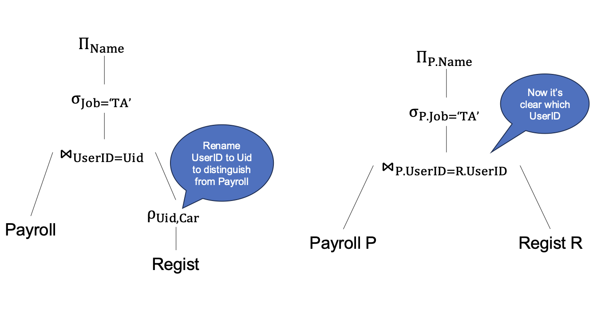
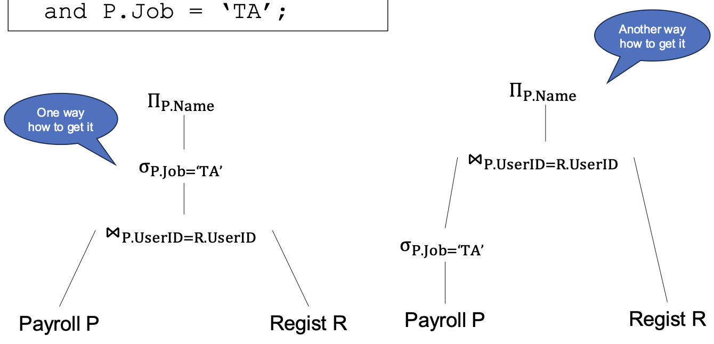
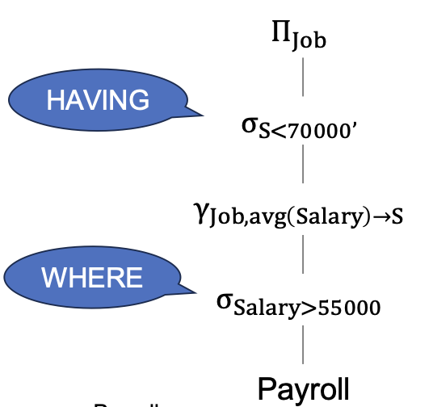
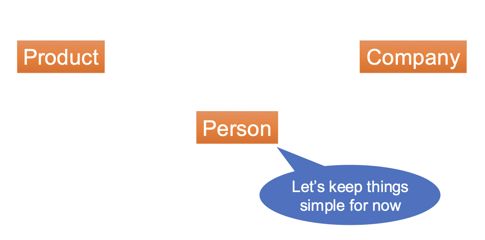
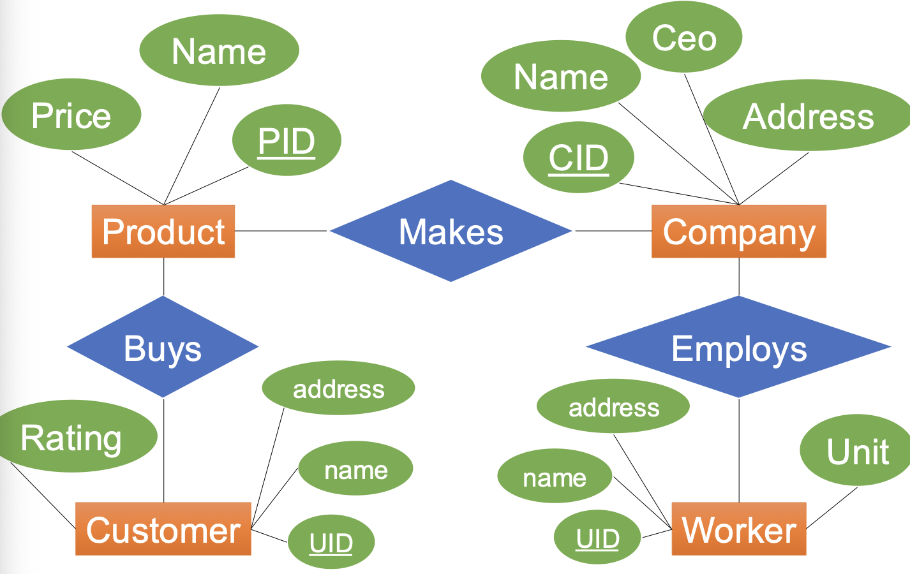
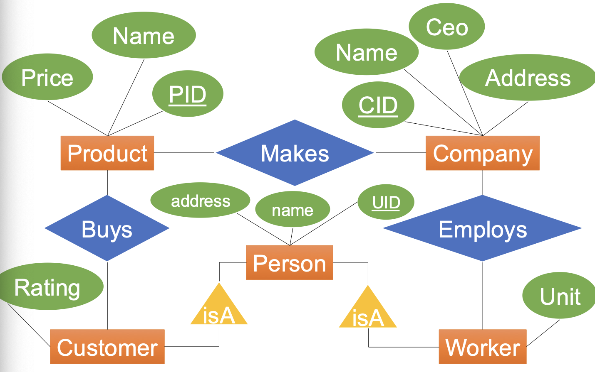

# 2025-04-17/Lecture 6: Relational Algebra & ER Diagrams

## Motivation

SQL is a high-level, human-readable language to express *what* the query should return, but not *how* it does it&mdash;it's what we call a **declarative** language. This is actually a good thing. Abstraction of the "how" from the "what" gives the engine the flexibility to optimize what we give it, exploring different execution plans that may be functionally equivalent but more efficient on actual hardware, all transparent to the programmer.

Of course, this means the **query optimizer** needs to first convert the human-readable query into an intermediate language suitable for a *machine* to *optimize* and ultimately *execute*. This intermediate language is **relational algebra (RA)**. We'll see that by modeling database operations as an algebra, we can manipulate identities that come with it to explore different execution plans with differing costs and efficiencies.

The basic relational operators are:

1. [Selection](#selection) $\sigma_{\text{condition}}(S)$
2. [Projection](#projection) $\Pi_{\text{attrs}}(S)$
3. [Join](#join) $R \bowtie_\theta S = \sigma_\theta(R \times S)$
4. [Union](#union) $\cup$
5. [Set difference](#set-difference) $-$
6. [Renaming](#renaming) $\rho$

## Selection

$$\sigma_{\text{condition}}(T)$$

On its own, this is equivalent to the SQL:

```sql
SELECT *
FROM T
WHERE condition;
```

That is, selection $\sigma$ within a larger query corresponds to the `WHERE` clause. It's the "row filter" as described all the way back in Lecture 1.

Speaking of, we can revisit the loop semantics of queries as an alternate way to understand this operation. We can emulate a SQL table with a `list` of objects in Python:

```python
from dataclasses import dataclass

@dataclass
class Payroll:
  UserId: int
  Name: str
  Job: str
  Salary: int

examples = [
  Payroll(1, "John Doe", "Software Engineer", 70_000),
  Payroll(2, "Jane Smith", "Data Scientist", 80_000),
  Payroll(3, "Alice Johnson", "Product Manager", 90_000),
  Payroll(4, "Bob Brown", "UX Designer", 60_000),
  Payroll(5, "Charlie Davis", "DevOps Engineer", 75_000),
]
```

> [!TIP]
>
> You can use [dataclasses](https://docs.python.org/3/library/dataclasses.html) in Python to very concisely define "struct" classes (classes meant to represent [a simple record/bundle of attributes](https://en.wikipedia.org/wiki/Passive_data_structure)). This replaces the traditional boilerplate of monotonously extending `__init__` and `__repr__` methods as shown in lecture.

A selection is then functionally equivalent to loops such as:

```python
# SELECT * FROM examples WHERE Salary >= 55000;
for p in examples:
  if p.Salary >= 55000:
     print(p)

# SELECT * FROM examples
# WHERE Salary >= 55000 AND Job = "Software Engineer";
for p in examples:
  if p.Salary >= 55000 and p.Job == "Software Engineer":
    print(p)
```

## Projection

$$\Pi_{\text{attrs}}(T)$$

On its own, this is equivalent to the SQL:

```sql
SELECT attrs
FROM T;
```

That is, projection $\Pi$ within a larger query corresponds to the `SELECT` clause. It's the "column filter". It's called a "projection" because we *project* ("map") the complete set of columns to some arbitrary subset of it.

Continuing our Python analogy, projection would look like:

```python
# SELECT Job, Name FROM examples;
for p in examples:
  print(p.Job, p.Name)
```

Recall from Lecture 1 that a projection can actually be generalized even further to an **extended projection**, where we allow arbitrary *expressions* on the projected columns as well. For example:

```python
# SELECT Job, Salary * 100 FROM examples;
for p in examples:
  # Salary in cents or something lol idk.
  print(p.Job, p.Salary * 100)
```

## Join

Here's where it gets more interesting because now we have a *binary* operator operating on multiple tables at once.

$$S \bowtie_\theta T$$

On its own, this is equivalent to the SQL:

<table>
<tr>
<td>

```sql
SELECT *
FROM S JOIN T
ON /* theta */;
```

</td>
<td>

```sql
SELECT *
FROM S, T
WHERE /* theta */;
```

</td>
</tr>
</table>

> [!NOTE]
>
> Why do we invent a new operator $\bowtie_\theta$ when it's functionally equivalent to $\sigma_\theta$ on a Cartesian product ($\times$)? In practice, the underlying database separately implements the "join" operation. They use special algorithms that *don't* take the full Cartesian product first. That would be terribly inefficient!

Variations of **join** (specifically, **inner join**) include:

- **Theta-join**: the most general form where we have some condition $\theta$. For example: $\text{Payroll} \bowtie_{\text{UserID}<\text{UserID}} \text{Regist}$.
- **Eq-join (equi-join)**: a specific type of theta-join where the condition is specifically an equality condition. For example: $\text{Payroll} \bowtie_{\text{UserID}=\text{UserID}} \text{Regist}$.
- **Cartesian product**: a join with all possible pairs between the operand tables. This is the degenerate case of a theta-join, where the condition is simply `true`. For example: $\text{Payroll} \times \text{Regist}$.
- **Natural join**: a special type of join where the condition is already defined for you based on the common attributes between the operand tables.

### Natural Join

The only new one here is the **natural join**:

$$S \bowtie T$$

> Join $S$, $T$ on common attributes, retain only one copy of those attributes.

> [!WARNING]
>
> What sets a natural join apart is that its condition is *implicit*. The join is defined to automatically join on the common attributes. Nothing you can do about it.

Consider some examples: what do these natural joins output?

$$R(A, B) \bowtie S(B, C)$$

$R$ and $S$ share one attribute, $B$. The natural join would thus be the equi-join on $B$: $R \bowtie_{R.B=S.B} S$.

Using this concrete example, how many tuples would that natural join output?

<table>
<tr>
  <th>R</th>
  <th>S</th>
</tr>
<tr>
<td>

| A   | B   |
| --- | --- |
| 1   | 10  |
| 2   | 10  |
| 2   | 20  |

</td>
<td>

| B   | C   |
| --- | --- |
| 10  | 8   |
| 10  | 9   |
| 20  | 8   |
| 50  | 7   |

</td>
</tr>
</table>

<details>
<summary>Expand for the answer.</summary>

**5 tuples.** Each `10` in `R.B` would match with both `10` in `S.B`, contributing $2 + 2 = 4$ tuples. The `20` in `R.B` would match with the singular `20` in `S.B`, contributing one more tuple.

| R.A | R.B | S.B | S.C |
| --- | --- | --- | --- |
| 1   | 10  | 10  | 8   |
| 1   | 10  | 10  | 9   |
| 2   | 10  | 10  | 8   |
| 2   | 10  | 10  | 9   |
| 2   | 20  | 20  | 8   |

</details>

$$R(A, B) \bowtie S(C, D)$$

Since $R$ and $S$ don't share any attributes, the join key would be *degenerate*, making this join just the full **Cartesian product** $R \times S$.

Using this concrete example, how many tuples would that natural join output?

<table>
<tr>
  <th>R</th>
  <th>S</th>
</tr>
<tr>
<td>

| A   | B   |
| --- | --- |
| 1   | 10  |
| 2   | 10  |
| 2   | 10  |

</td>
<td>

| C   | D   |
| --- | --- |
| 8   | u   |
| 9   | v   |
| 8   | v   |
| 7   | w   |

</td>
</tr>
</table>

<details>
<summary>Expand for the answer.</summary>

**12 tuples.** The size of the Cartesian product of relations with size $|R|$ and $|S|$ would be $|R|\cdot|S| = 3 \cdot 4 = 12$.

| R.A | R.B | S.C | S.D |
| --- | --- | --- | --- |
| 1   | 10  | 8   | u   |
| 1   | 10  | 9   | v   |
| 1   | 10  | 8   | v   |
| 1   | 10  | 7   | w   |
| 2   | 10  | 8   | u   |
| 2   | 10  | 9   | v   |
| 2   | 10  | 8   | v   |
| 2   | 10  | 7   | w   |
| 2   | 20  | 8   | u   |
| 2   | 20  | 9   | v   |
| 2   | 20  | 8   | v   |
| 2   | 20  | 7   | w   |

</details>

$$R(A, B) \bowtie S(A, B)$$

$R$ and $S$ fully share their attributes, so the natural join on them is equivalent to the **intersection** between the two relations: $R \cap S$.

Using this concrete example, how many tuples would that natural join output?

<table>
<tr>
  <th>R</th>
  <th>S</th>
</tr>
<tr>
<td>

| A   | B   |
| --- | --- |
| 1   | 10  |
| 2   | 10  |
| 2   | 20  |

</td>
<td>

| A   | B   |
| --- | --- |
| 1   | 10  |
| 2   | 20  |

</td>
</tr>
</table>

<details>
<summary>Expand for the answer.</summary>

**2 tuples.** Only rows that are exact matches across $R$ and $S$ are kept:

| R.A | R.B | S.A | S.B |
| --- | --- | --- | --- |
| 1   | 10  | 1   | 10  |
| 2   | 20  | 2   | 20  |

</details>

**ASIDE:** Are natural joins useful in real life?

Consider the example of joining a `people` and `pets` table that share a `name` attribute, except `name` means something different in each of them (name of the person vs. name of the pet). In this case, a natural join between these tables would not make any conceptual sense.

They're called "natural" because they're natural to database theorists, with origins from first-order logic. In practical settings, natural joins only work well if the schema across different tables are defined in a way such that identically-named attributes always refer to the same thing.

To quote my professor from when I took CS 143, on the topic of whether to use natural joins:

> When it's relational algebra, A-OK. When it's SQL, no way. &mdash;Professor Ryan Rosario

### Other Joins

We've gone over these joins in previous lectures:

- **Inner joins** $R \bowtie S$: (the default `JOIN` in SQL) keep only the joined rows where the condition is satisfied. Variations include eq-join, theta-join, Cartesian product, natural join.
- **Outer joins**:
  - **Left outer joins** $R ⟕ S$: keep the joined rows where the condition is satisfied as well as all remaining rows from the left table, padding the right-side columns with `NULL`.
  - **Right outer joins** $R ⟖ S$: keep the joined rows where the condition is satisfied as well as all remaining rows from the right table, padding the left-side columns with `NULL`.
  - **Full outer joins** $R ⟗ S$: like both the left and right outer join at the same time. All joined rows are kept, with `NULL` padded on the side where there was no match for that side.

There's also another type of join called the **semi join**:

$$R ⋉ S$$

It returns a *subset* of the left table, the rows that matches with the right table.

How do we implement a semi join with SQL? Two ways, using the predicate operators we learned last lecture (`sqlite3 data/lec5.db`):

<table>
<tr>
<td>

```sql
SELECT name FROM pets
WHERE EXISTS
(SELECT * FROM people
  WHERE pets.person = people.name);
```
```console
┌──────┐
│ name │
├──────┤
│ casa │
│ kira │
│ toby │
└──────┘
```

</td>
<td>

```sql
SELECT name FROM pets
WHERE pets.person IN
(SELECT name FROM people);
```
```console
┌──────┐
│ name │
├──────┤
│ casa │
│ kira │
│ toby │
└──────┘
```

</td>
</tr>
</table>

## Union

$$S \cup T$$

This takes the **set union** of the two relations.

In SQL, we use:

```sql
S UNION T;
```

> [!WARNING]
>
> Requirement: the two relations must have the same schema.
>
> Also, because it's a *set* union, duplicates are eliminated. To keep duplicates, use the `UNION ALL` operator instead.

## Set Difference

$$S - T$$

This takes the **set difference** between the two relations. That is, keep the tuples in $S$ but exclude tuples that also appear in $T$.
In other words, keep the tuples in $S$ that do not also appear in $T$.

This is equivalent to the SQL:

```sql
S EXCEPT T;
```

> [!WARNING]
>
> Requirement: the two relations must have the same schema.
>
> Also, because it's a *set* difference, `EXCEPT` removes all occurrences of duplicate data from $S$. Use `EXCEPT ALL` to remove one occurrence of duplicate data from $S$ for every occurrence in $T$. [Source](https://stackoverflow.com/a/63544868/14226122).

## Renaming

$$\rho_{\text{attrs}}(T)$$

This simply renames attributes. This is used more so as a technicality for the relational algebra to "type-check", like when you want column names to not clash within a larger expression. In other words, it's just aliasing.

This is like when we use the `AS` keyword in SQL:

```sql
-- ERROR here because p replaces pets.
SELECT pets.name FROM pets AS p;
-- SELECT can reference the alias p created in FROM ... AS ...
SELECT p.name FROM pets AS p;
```

An example in relational algebra:

$$\rho_{\text{UserID,Model}}(\text{Regist})$$

What this means is, "rename the columns of the $\text{Regist}$ table to be $\text{UserId,Model}$ instead".

<table>
<tr>
  <th>Original</th>
  <th>Renamed</th>
</tr>

<tr>
<td>

| UserId | Car     |
| ------ | ------- |
| 123    | Charger |
| 567    | Civic   |
| 567    | Pinto   |

</td>
<td>

| UserId | Model   |
| ------ | ------- |
| 123    | Charger |
| 567    | Civic   |
| 567    | Pinto   |

</td>
</tr>
</table>

"Car" is conceptually the same as "Model", and maybe in this particular RA expression we want to refer to the column as "Model".

## Back to Monotonicity

Which operators are **monotone**? Recall that a **monotone query** is one where adding rows to the table cannot remove rows from the query result.

- **Selection**: monotone! Added rows either get included by the filter or they don't. They can't remove rows that were already matched prior.
- **Projection**: monotone! This doesn't alter the number of rows in the first place.
- **Join**: monotone! Recall that a join is the composition of a Cartesian product and a selection, both of which are monotone.
- **Union**: monotone! Adding rows either adds to the result or don't (in the case of duplicates). They can't remove rows that were already in the union prior.
- **Set difference**: NOT monotone: adding to the LHS doesn't remove rows from the result, but adding to the RHS might (since by definition we're *removing* rows in the LHS that also appear in the RHS).
- **Rename**: monotone, but this doesn't alter any row or column structure of queries in the first place anyway.

Something we kind of glossed over previously when introducing monotone queries is: what does it mean to be monotone when it's a binary operator?

A binary operator is monotone where, if we arbitrarily fix one side and add more rows to the other side, no rows should be removed from the result. Or in general for $k$-ary operators, you fix $k - 1$ tables and reason about how the result changes if we add rows to that one unfixed table.

## Query Plans

Now that we have relational algebra under our belt, we now try to understand how the database engines convert SQL to a **relational algebra plan**, or **query plan**.

Consider this example:

```sql
SELECT P.Name
FROM Payroll P, Regist R
WHERE P.UserID = R.UserID
  AND P.Job = "TA";
```

On the following tables:

<table>
<tr>
  <th>Payroll</th>
  <th>Regist</th>
</tr>
<tr>
<td>

| UserId | Name    | Job  | Salary |
| ------ | ------- | ---- | ------ |
| 123    | Jack    | TA   | 50000  |
| 345    | Allison | TA   | 60000  |
| 567    | Magda   | Prof | 90000  |
| 789    | Dan     | Prof | 100000 |

</td>
<td>

| UserId | Car     |
| ------ | ------- |
| 123    | Charger |
| 567    | Civic   |
| 567    | Pinto   |

</td>
</tr>
</table>

First the SQL is compiled to the equivalent relational algebra:

1. First optimize the Cartesian product (`FROM`) to a join.
2. Then apply `WHERE` as a selection.
3. Then apply `SELECT` as a projection.

$$\Pi_{\text{Name}}(\sigma_{\text{Job}=\text{``TA''}}(\text{Payroll} \bowtie \text{Regist}))$$

The composition of operations lends naturally to a tree structure, which represents the query plan:

```mermaid
graph BT;
  projection["project(Name)"];
  selection["select(Job='TA')"];
  join[natural join];
  payroll[Payroll];
  regist[Regist];
  payroll-->join;
  regist-->join;
  join-->selection;
  selection-->projection;
```

Note the bottom-up data flow.

Since we're joining on common attributes, **renaming** comes into play. We need to disambiguate names that are common across tables:



### Execution Order

Remember the **declarative** design of SQL? For given SQL, there are multiple ways to execute the equivalent query. That is, there are different valid **execution orders**:



Which one is more **efficient**? We actually can't know for sure, but it's likely that the *second* one is more efficient. Think about it: **selection** guarantees that the intermediate result is a subset of the original table, so we would be applying a join on a potentially smaller table downstream if we do the selection first!

This is known as "**selection push-down**", and it's one of many **heuristics** used automatically by the query.

**ASIDE:** When would it *not* be optimal to use selection push-down? A scenario that comes to mind is when we somehow know ahead of time the join will be empty, in which case there's no point in doing the selection beforehand.

On that note: a big part that powers the query optimizer is that it uses *statistics* based on the input data to influence how to optimize queries.

Circling back to RA: so why is RA useful? It gives us powerful algebraic **identities**, allowing the optimizer to play around with exploring equivalent plans and evaluating their costs. For example:

- $R \bowtie S = S \bowtie R$ (Commutativity)
- $R \bowtie (S \bowtie T) = (R \bowtie S) \bowtie T$ (Associativity)
- $\sigma_\theta(R \bowtie S) = \sigma_\theta (R) \bowtie S$ where $\theta$ operates only only columns in $R$ (enables **Push-Down Selection**).

In SQL server, there are about 500 such rules!

## SQL to RA

Consider a simple case of a `SELECT`-`FROM`-`WHERE` query:

1. Turn `FROM` into Cartesian product of the input tables.
2. Then apply selection based on `WHERE`.
3. Then apply projection based on `SELECT`.

```mermaid
graph BT;
  t1[T_1];
  t2[T_2];
  t3[T_3];
  tn[T_n];
  join1[⋈];
  join2[⋈];
  join3[⋈];
  selection["select(condition)"];
  projection["project(attrs)"];
  t1-->join1;
  t2-->join1;
  join1-->join2;
  t3-->join2;
  join2--"..."-->join3;
  tn-->join3;
  join3-->selection;
  selection-->projection;
```

What about the more complicated case where we have **aggregates**?

### Extended Relational Algebra

First, we'll extend our relational algebra toolkit and define a few more operators:

- Duplicate elimination $\delta(T)$: eliminates duplicates from the bag $T$.
- Group-by aggregate $\gamma_{\text{attr1,attr2,...agg1,...}}$: group by the specified attributes, then aggregate by the specified aggregate functions.

**Duplicate elimination** is pretty straightforward. It's equivalent to our handy `SELECT DISTINCT` clause we've used so many times now:

```sql
SELECT DISTINCT *
FROM T;
```

**Group-by aggregate** is a bit more involved. This RA expression below means "group by $\text{Job}$, then take the average of the $\text{Salary}$ column, saved into a new column called $S$":

$$\gamma_{\text{Job,avg(Salary)}\rightarrow S}$$

When we have $\gamma$, we can assume we have an output attribute, specified by $\rightarrow$. You can think of it like the aliasing from the **rename** operator $\rho$ but built into $\gamma$. In SQL, it's like using the `AS` operator all the same:

```sql
SELECT AVG(Salary) AS S
FROM Payroll
GROUP BY Job;
```

Note that in RA, there's no direct equivalent for the `HAVING` clause in SQL. We just reuse the selection operator $\sigma$. The difference comes from whether $\sigma$ is applied before or after the aggregation:

- $\sigma$ corresponding to a `WHERE` is applied before aggregation.
- $\sigma$ corresponding to a `HAVING` is applied after aggregation.

For example, this SQL query:

```sql
SELECT Job
FROM Payroll
WHERE Salary > 55000
GROUP BY Job
HAVING AVG(Salary) < 70000;
```

Compiles to this query plan. Note two "phases" of selection $\sigma$:



## Nested SQL to RA

Last lecture we made a whole fuss about sub-queries and un-nesting. Relational algebra is an algebra that can't have nested expressions, nor can we directly express predicates like `EXISTS`/`NOT EXISTS`. Thus, the query optimizer needs to first unnest the SQL query, then convert it to RA.

### Unnesting `WITH`

First consider the simple case of when we use the `WITH` clause (recall that that's like creating a temporary "local variable" that's then used by the rest of the query):

```sql
WITH Cardrivers AS
  (SELECT DISTINCT P.*
  FROM Payroll P, Regist R
  WHERE P.UserId=R.UserID)
SELECT AVG(Salary)
FROM Cardrivers;
```

With this setup, we can simply separate the two queries. We compute the sub-query first to produce some intermediate result table, then apply the remaining operators on that table:


### Unnesting Monotone Queries

Next, let's consider another simple case: **monotone** queries. This is where we'll see why they're great!

```sql
SELECT P.UserID, P.Name
FROM Payroll P
WHERE EXISTS
(SELECT *
  FROM Regist R
  WHERE P.UserID = R.UserID);
```

Remember that `EXISTS` doesn't exist in RA. We need to unnest first *Because* the query is monotone, unnesting it is straightforward:

```sql
SELECT DISTINCT P.UserID, P.Name
FROM Payroll P, Regist R
WHERE P.UserID = R.UserID;
```

Now it's straightforward to translate to RA and its corresponding query plan:

```mermaid
graph BT;
  payroll[Payroll P];
  regist[Regist R];
  join["⋈(P.UserID=R.UserID)"];
  projection["project(P.UserID,P.Name)"];
  distinct[DISTINCT];
  payroll-->join;
  regist-->join;
  join-->projection;
  projection-->distinct;
```

**ASIDE:** In lecture, we noticed that there's actually something off about this example. What is it?

`SELECT DISTINCT` in the unnested version but not the original. The original query can have duplicates, so this unnesting isn't actually a completely faithful unnesting. A good query optimizer might first check if there are duplicates first to see if it's safe to do the un-nesting. If it isn't, then we can't do better than just re-running the inner query for every iteration of the outer query. That is, we *can't* simply unnest the query into a join that only needs to be run once. Yikes!

<!-- Continuing down the rabbithole: why did we introduce `DISTINCT` in the first place? If we didn't have `DISTINCT` for the join, the join might *introduce* duplicates, so we do need the `DISTINCT`. TODO: I remember Professor mentioning something about this at the time but I don't really get why. -->

> [!NOTE]
>
> The astute among you might notice that the original query is an example of a [**semijoin**](#other-joins)!

### Unnesting Non-Monotone Queries

Finally, what if our query is not so nice. Consider the more difficult, non-monotone example of `NOT EXISTS`:

```sql
SELECT P.UserID
FROM Payroll P
WHERE NOT EXISTS
(SELECT *
  FROM Regist R
  WHERE P.UserID = R.UserID);
```

Remember that `NOT EXISTS` doesn't exist in RA. We need to unnest first. However, in this case, because it's a **correlated sub-query**, we need to **de-correlate** before even that.

> [!NOTE]
>
> Recall that a **correlated sub-query** is one where the inner query references a table from the outer query.

To de-correlate, we first convert `NOT EXISTS` to `NOT IN`:

```sql
SELECT P.UserID
FROM Payroll P
WHERE P.UserID NOT IN
(SELECT R.UserID FROM Regist R);
```

Once it's an **uncorrelated sub-query**, we can safely extract it into its own query that's run only once. We can unnest using set difference.

```sql
SELECT P.UserID
FROM Payroll P
EXCEPT
SELECT R.UserID
FROM Regist R;
```

Finally, this can be compiled down to RA and its corresponding query plan:

```mermaid
graph BT;
  payroll[Payroll P];
  regist[Regist R];
  projectionP["project(P.UserID)"];
  projectionR["project(R.UserID)"];
  except[EXCEPT];
  payroll-->projectionP;
  regist-->projectionR;
  projectionP-->except;
  projectionR-->except;
```

> [!TIP]
>
> You can use `EXPLAIN <query>` in SQLite to return an explanation of how SQLite will execute that query. You can also use [the umbra-db.com online tool](https://umbra-db.com/) to get a more visual and interactive explanation of the execution tree.

## Database Design

Every application needs a database, and that database will likely need to service it all the time, indefinitely. It's important to have a good design from day 1 because it's hard to change it later.

Database design is interdisciplinary and incorporates feedback from many stakeholders: programmers, business teams, analysis, data scientists, product managers, etc.

### Database Design Process

The design process involves many layers of abstraction:

1. The *conceptual model*, where we draw out an [ER diagram](#er-diagrams) to abstractly define the entities involved and the relationships between them.
2. The *relational model*, where we translate the ER diagram into table schemas and constraints.
3. The *conceptual schema*, where we refine our database schemas through **normalization**.
4. The *physical schema*, which is how the database organizes data on disk via partitioning and indexing.

### ER Diagrams

**Entity-Relationship (ER) Diagrams** are a visual way to describe the organization of a database, including relationships among the different entity types. They are language independent (not tied to SQL specifically).

Consider this scenario where we're designing some application to track the lifetime of products. Our "entities" in this case would include:

- *Products* with name, price, etc.
- *Companies* (manufacturers) with addresses workers, etc.
- *Customers* (buyers) with name, etc.

First, we design the **entity sets**. We answer questions like:

- What should go in their own tables? For example, should we separate "buyers" from "workers"? Or keep things simple and combine them to some "person" entity?



Then we add **attributes** to those entity sets. We answer questions like:

- What attributes should each entity have? For example:
  - A product should have a price, name, PID (product ID)
  - A company should have a name, CEO, address, CID (company ID)
  - A person should have a name, address, UID (user ID)


Then we add **relationships** between the entity sets. Maybe then it becomes obvious that we want to separate customers from workers instead of having a single "person" entity:



Then we refine the database schemas. For example, we might de-duplicate common attributes by defining an inheritance hierarchy:


