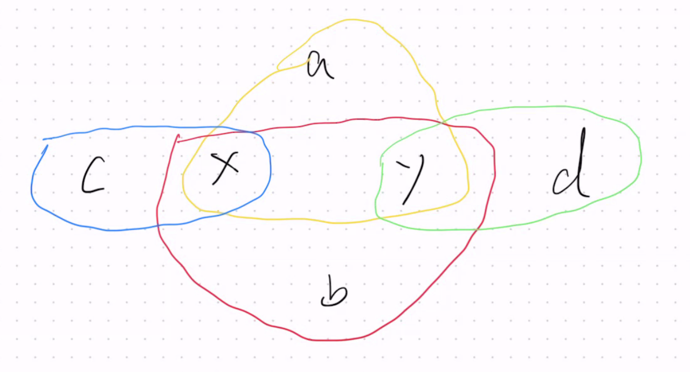
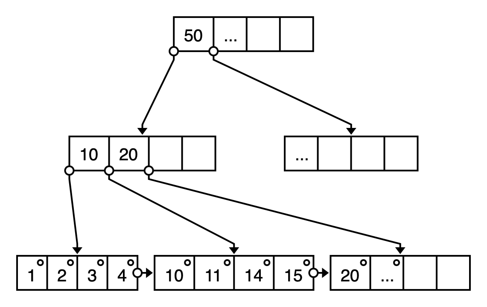
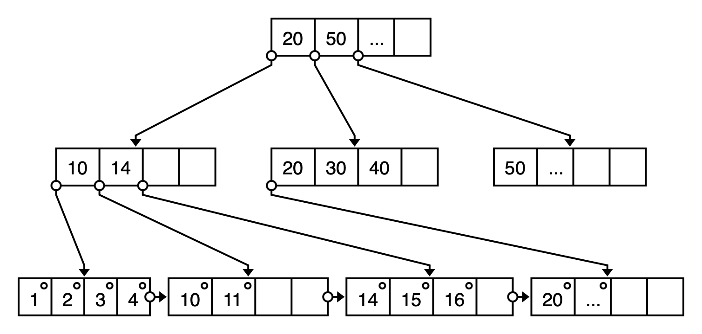
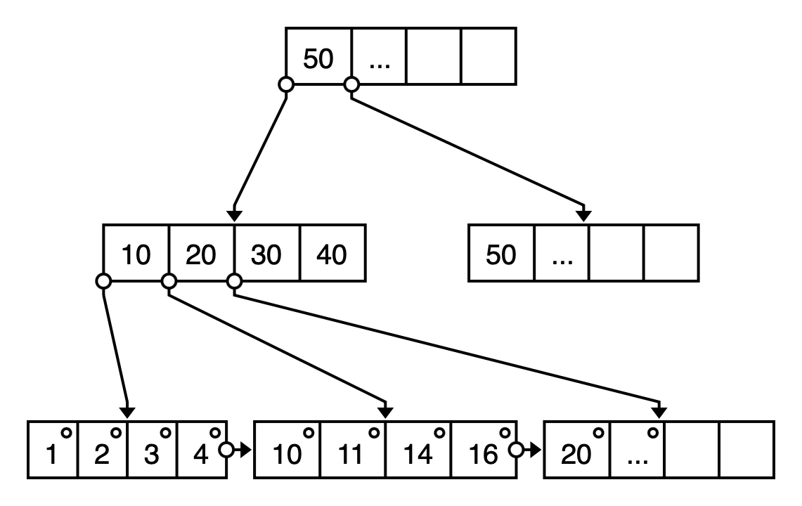
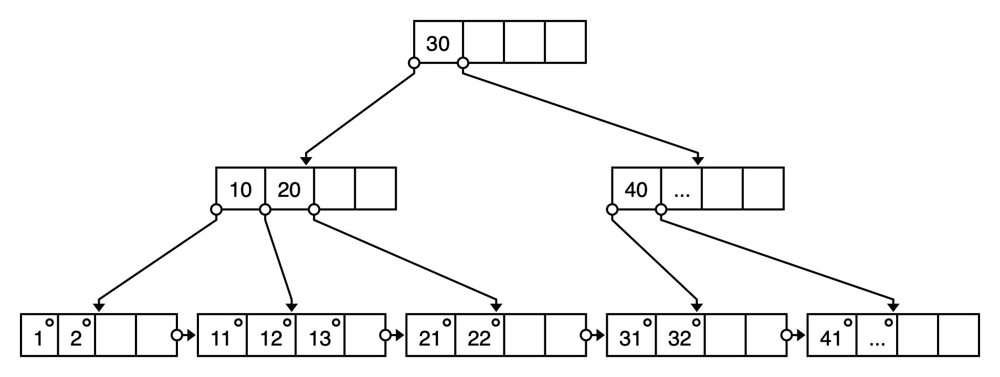
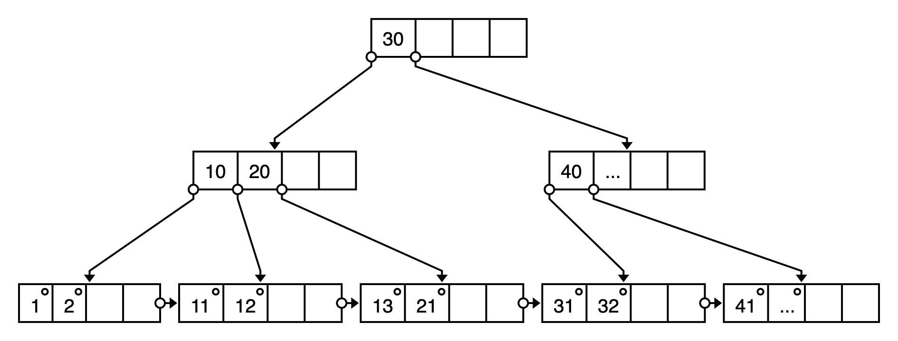
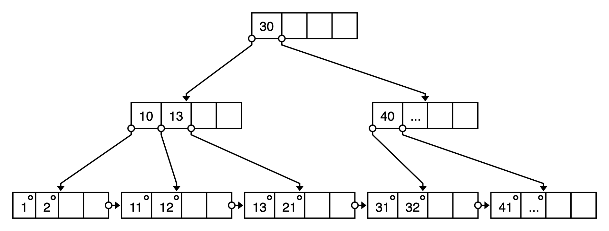

# 2025-05-22/Lecture 16: B+ Trees Continued

## Lecture Quiz

### Question 1

> Consider the natural join of R(x, y), S(y, z, w), T(z, w, i), U(z, w, j).
>
> In the hypergraph for the join, which relations are ears? Choose all that apply.
>
> - [ ] R
> - [ ] S
> - [ ] U
> - [ ] None of the above

<details>
<summary>Expand for answer.</summary>

CORRECT: **R, S, U**

$\text{keyattr}_Q(R) = \lbrace y \rbrace \subseteq S$. Thus, $R$ is an ear.

There is no other relation that contains all of $\text{keyattr}_Q(S) = \lbrace y, z, w \rbrace$. Thus, $S$ is not an ear.

$\text{keyattr}_Q(T) = \lbrace z, w \rbrace \subseteq S, U$ both. Thus, $T$ is an ear.

$\text{keyattr}_Q(U) = \lbrace z, w \rbrace \subseteq S, T$ both. Thus, $U$ is an ear.

</details>

### Question 2

> For the same query above, which relations can be a parent of T? Choose all that apply.
>
> - [ ] R
> - [ ] S
> - [ ] U
> - [ ] None of the above

<details>
<summary>Expand for answer.</summary>

CORRECT: **S, U**

From the explanation for [Question 1](#question-1), we see that because the key attributes of $T$ are a subset of both $S$ and $U$, the possible parents of $T$ are $S$ and $U$.

</details>

### Question 3

> For the same query above, what are the key attributes of S? Choose all that apply.
>
> - [ ] z
> - [ ] y
> - [ ] w
> - [ ] None of the above

<details>
<summary>Expand for answer.</summary>

CORRECT: **z, y, w**

$z \in S$ is shared with $T$ and $U$. $y \in S$ is shared with $R$. $w \in S$ is shared with $T$ and $U$. Thus:

$$\text{keyattr}_Q(S) = \lbrace z, y, w \rbrace$$

</details>

### Question 4

> Consider the following natural join queries:
>
> Q1: R(x, y, z) ⋈ S(x, a) ⋈ T (y, b) ⋈ U (z, c)
> Q2: R(x, y) ⋈ S(y, z) ⋈ T(z, w)
> Q3: R(x, y, z) ⋈ S(x, y, z) ⋈ T(x, y, z)
>
> Which of the queries are acyclic? Choose all that apply.
>
> - [ ] Q1
> - [ ] Q2
> - [ ] Q3
> - [ ] None of the above

<details>
<summary>Expand for answer.</summary>

CORRECT: **Q1, Q2, Q3**

$Q_1$: This graph is [isomorphic](https://en.wikipedia.org/wiki/Graph_isomorphism) to the first hypergraph we considered last lecture. We already know such a hypergraph is acyclic. We can remove ears in an example order of $U \to R \to T \to S$.

This kind of hypergraph shape actually has a special name: it's a **star query**. You can think of $S$ as a huge table that corresponds to all the "objects" in your database, also known as the **fact table**. The other tables $S, T, U$ are **dimension tables**. For example, a fact table might consolidate "student" objects, and the other dimension tables are interested in only a particular attribute of each student and relate that to possibly other attributes.

$Q_2$: If you work through GYO reduction, you get the predicate graph:

```mermaid
graph TD;
  R<--y-->S<--z-->T;
```

This kind of hypergraph also has a name: it's known as a **chain schema**. Such a pattern is studied extensively in research, but probably not that practical in real world settings.

$Q_3$: The hypergraph is simply 3 circles around all of $x, y, z$. This is kind of a degenerate case. For all of $R, S, T$, their key attributes are the entire set of attributes $\lbrace x, y, z \rbrace$, which is also equal to the set of their own attributes. For this reason, every hyperedge is an ear, with any other hyperedge as a parent. This relationship continues to hold as you go through GYO reduction. You'll ultimately get the predicate graph:

```mermaid
graph TD;
  R[R];
  S[S];
  T[T];
  R<--"x"-->S;
  R<--"y"-->S;
  R<--"z"-->S;
  S<--"x"-->T;
  S<--"y"-->T;
  S<--"z"-->T;
```

This also has a name: a **clique query**.

All of $Q_1, Q_2, Q_3$ are acyclic.

</details>

### Question 5

> Which of the following statements are true? Choose all that apply.
>
> - [ ] An acyclic hypergraph remains acyclic after adding any hyperedges
> - [ ] An acyclic hypergraph remains acyclic after removing any hyperedges
> - [ ] An ear remains an ear after any other ears are removed
> - [ ] A non-ear remains a non-ear after other ears are removed
> - [ ] None of the above

<details>
<summary>Expand for answer.</summary>

CORRECT: **None of the above**

> An acyclic hypergraph remains acyclic after adding any hyperedges

Consider the hypergraph:

```mermaid
graph TD;
  x<-->y;
  x<-->z;
```

Adding `y<-->z` makes it cyclic. Thus, this statement is false.

> An acyclic hypergraph remains acyclic after removing any hyperedges

Consider the technique described last lecture where we *made* a cyclic hypergraph acyclic by adding one giant relation that covers all attributes of the other relations. If we go *backwards* (i.e. *remove* that giant hyperedge), we go from having an acyclic hypergraph back to a cyclic one. Thus, this statement is false.

> An ear remains an ear after any other ears are removed

Consider this hypergraph:



All of $(y, d), (c, x), (x, y, b), and (a, x, y)$ are ears. If we remove $(x, y, b)$, then $(a, x, y)$ is no longer an ear because we removed its parent.

Thus, we removing an ear can actually make other hyperedges *stop* being an ear. Namely, when the ear we remove happens to be the only **parent** of another hyperedge.

We can see this with a simpler example too (as provided by one of the students in lecture):


The blue and yellow hyperedges are both ears *because* of each other (the fact that they contain all attributes means they must be supersets of the other relation's key attributes). It follows that they are also each other's parent. However, if we remove one (e.g. the blue hyperedge), the other hyperedge is no longer an ear because their parent is now gone.

> A non-ear remains a non-ear after other ears are removed

In general, we've seen in previous examples that we can start with a hypergraph where not everyone is an ear to start with, yet we're able to reduce the hypergraph to an empty hypergraph anyway. That must mean that in the process, non-ears can *become* ears at some point. The statement is false.

You can also consider a concrete example. Take this chain query for example:

```mermaid
graph LR;
  x<-->y;
  y<-->z;
  z<-->w;
```

$(y, z)$ starts as a non-ear, but after removing the ear $(z, w)$, it turns $(y, z)$ *into* an ear.

</details>

## B+ Trees (Continued)

Last lecture, we introduced the **B+ tree**, which is actually an extension of the **B tree** data structure specialized for database applications. In a B+ tree, we only store table keys in the **leaf nodes** and also connect the leaf nodes as a linked list.

> [!WARNING]
>
> From here on out, Professor may use B tree and B+ tree interchangeably. Know that he's always referring to B+ trees unless specified otherwise.

### Node Structure

Internal nodes store **node keys**. These values encode *ranges* of table keys that their subtrees ultimately contain at their leaves.

Leaf nodes store **table keys**. These are actual key values from database tables e.g. `student_id`.

Every node has a *fixed* length. We'll define the number of keys stored as **capacity**. In standard terminology, we also have this definition:

$$\text{degree} = \frac{\text{capacity}}{2}$$

This comes from another invariant of the B+ tree:

> [!IMPORTANT]
>
> Every B+ tree node except for the root is always at least half full.

Thus, you can think of the **degree** as at least how many entries you want to have in a node. It follows then that the capacity is just double that.

The number of *pointers* stored in **internal nodes** is the $\text{capacity} + 1$. Each pointer sits "between" an adjacent pair of keys, with pointers at the the two edges as well. Each pointer points to a subtree containing table keys in the interval $[\text{left}, \text{right})$, where $\text{left}$ is the node key on the pointer's left and $\text{right}$ is the node key on the pointer's right. The pointers on the edges simply use their respective infinity as the other bound.

Consider this example internal node with $\text{capacity} = 4$, with node keys $10, 20, 30, 40$ (B+ trees rendered using the [B-Sketcher online tool](https://projects.calebevans.me/b-sketcher/)):


There are $4 + 1 = 5$ pointers. From left to right, they direct to subtrees with key values:

- $k < 10$
- $10 \le k < 20$
- $20 \le k < 30$
- $30 \le k < 40$
- $k \ge 40$

Remember that the intervals are closed on the lower end and open on the upper end.

**Leaf nodes** instead store a pointer per table key, namely to the actual record associated with the table key.

Other important properties:

- All keys within a B+ tree node are **sorted**.
- A B+ tree by nature is **balanced**. All leaves are always at the same level.

### Searching a B+ Tree

Searching a B+ tree is very similar in nature to searching a **binary search tree (BST)** in that we compare the queried value $k$ to the current node to decide which pointer to follow. In the case of a B+ tree internal node, we have multiple node keys to test. Because they are stored in sorted order, we can simply sweep the node keys until we reach one that is $\ge k$. We then follow the pointer that sits just before that node key (or use the last pointer if $k$ happens to be $\ge$ every node key).

For example, suppose we're searching for $k=12$ in this B+ tree:


1. We start at the root node and linearly scan the node keys until we reach a node key $K$ such that $k < K$. In this case, $k = 12 < 50$, so we follow the first pointer down the tree.
2. We then linearly scan node keys again. $12 \ge 10$, so we move on. $12 < 20$, so we follow the second pointer down the tree.
3. Now we're at the last level, so we just linearly scan the table keys until we find $k$, or declare that $k$ is not in the tree if we reach the end of the node. We check $10$, $11$, and then finally $12 = k$, so we've found our table key.

Leaf nodes store pointers to the actual records associated with the table keys, so if we want to retrieve the actual data for $k = 12$, we can now do that through the pointer.

Notice that the sorted nature of the keys as well as the pointers between leaf nodes make **range queries** similarly easy to implement. Suppose we're interested in all keys in the range $[3, 13]$.

1. We'll first traverse down the tree as outlined above to locate $k = 3$. Then, we simply continue the linear scan down the leaf node to collect $k = 4 \le 13$.
2. We still have leaf nodes left and have not reached our upper bound $13$ yet, so we can follow the horizontal pointer to the next leaf node and continue our linear scan. We collect $k = 10, 11, 12, 13 \le 13$. Now at this point, we can stop.
3. We've found the keys $\lbrace 3, 4, 10, 11, 12, 13 \rbrace \in [3, 13]$. If we want the data associated with those keys, we can access them through the stored pointers.

### Inserting into a B+ Tree

Insertion is a lot more involved because of the tricky invariants we need to maintain at all times in the B+ tree. Namely, every node has a *fixed* length (capacity), and parent node keys have to be kept in lock step with their children key ranges.

There are two cases we'll consider:

**CASE I:** "Just insert". We traverse down the B+ tree to the correct leaf node, and if the node still has vacancy *and* the key belongs after all the other existing keys in the node, just insert that key in the first vacant slot.

Suppose we want to insert $k=14$ into this B+ tree:


We would simply insert it right after $11$ in its leaf node:


**CASE II:** If the correct leaf node is already at capacity:

1. We first pretend to insert $k$ anyway, "overflowing" it.
2. We then *split* the leaf node into two halves. The existing leaf node just drops the greater half of its keys, keeping the lesser half. The greater half of the keys get assigned to a newly allocated leaf node (with the original node connecting to the new node to close the linked list).
3. Update the parent. Shift over its keys & pointers and insert the lower bound of the new node as the key for the new vacancy, directing a new pointer down to the new node. If the parent is already full, recurse: treat the insertion into the parent node as its own Step 1&mdash;pretend to overflow it and follow the same splitting algorithm. If this recurses all the way up to the root, a new root may be created.

Suppose we want to insert $k=16$ into this B+ tree:



First we pretend like we inserted $16$ right after $15$ in its node:


We then split the node into halves and connect them:


Pretend that the `|-->|` in the middle of the leaf node represents a splitting into two leaf nodes and a pointer connecting them. I can't draw them as separate nodes or the online tool will automatically connect parent pointers, which we haven't gotten to yet.

We now need to update the parent because we have a new node with table keys $(14, 15, 16)$ that needs a pointer down to it. Namely, the parent should have a pointer just after a new node key of $14$, since the new node contains values $\ge 14$. In this case, the parent is already at capacity, so we'll recurse: pretend to insert $14$, overflowing it:


Then split it and update *their* parent (this time, the parent has vacancy, so the insertion does not cause further recursing):



### Deleting from a B+ Tree

Deletion is similarly involved because of the aforementioned invariants but also the one where every node needs to be at least half full at all times.

We consider three cases:

**CASE I:** "Just delete". If deleting an entry would *not* cause a node to go below half its capacity, just delete it, and you're done.

For example, we can simply delete $k=16$ from its node here:



**CASE II:** If deleting *would* cause the node to fall below the capacity invariant, you "steal" from your neighbor.

For example, suppose we delete $k=11$ from this B+ tree:



The node would fall below half capacity, so we can "steal" $4$ from its left neighbor:



But that also means we need to update the parent because the parent's node key needs to reflect the child's new lower bound:



Note that we can also steal from the leaf node's right neighbor if need be (also updating its parent pointer's associated key).

**CASE III:** What if both neighbors would also fall below capacity if we steal from them? For insertion, the recursive chain reaction can be done in $\log(N)$ steps because it goes upwards into parent levels. If we were to chain react *horizontally* (among leaf nodes), it could take $\frac{N}{2} \in O(N)$ steps. This is no bueno. Instead, we can borrow the same principle from insertion, but in reverse this time. Like how we split in insertion, we can *merge* nodes together:

1. Delete the key.
2. Then merge the leaf node with its neighbor.
3. Update parent.

Note that this case is only taken if the nodes involved are already at half capacity, so merging the nodes is always valid (it won't cause the newly merged node to overflow; the invariants are maintained).

For example, suppose we want to remove $k=11$ from this B+ tree:


We can't steal from either neighbor because they're already at half capacity. Let's first delete $11$ anyway. Then, *merge* the node with its left neighbor:


Notice that the parent's node key is now outdated&mdash;the node key $10$ implies that all table keys below the leftmost pointer are $< 10$, but that's no longer true because we now have table key $10$ from the merge. We update the parent by deleting that node key as well and shifting over the node keys:


Finally, as an exercise: what happens if that causes the parent node to itself fall below half capacity? Think about how we can continue, considering how we handled it for [insertions](#inserting-into-a-b-tree).

## Indices in SQLs

How do we add an index in SQL?

From https://www.sqlitetutorial.net/sqlite-index/:

```sql
CREATE INDEX index_name
ON table_name(column_list);
```

There are two types of indices:

- **Clustered** indices: in addition to creating the index, the records themselves are also stored contiguously in memory.
- **Unclustered** indices: the records might not be in contiguous in record.

To be continued.
